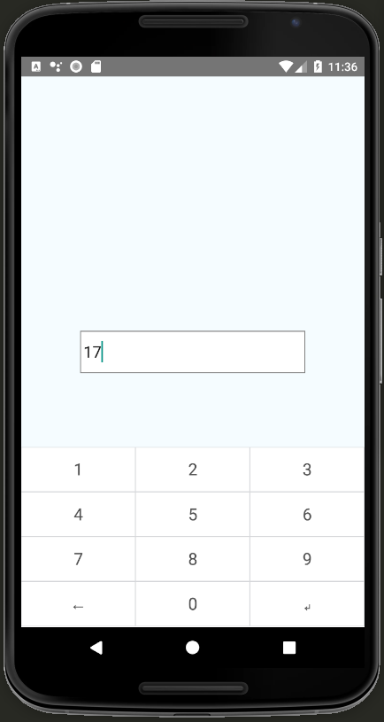

# react-native-custom-keyboard-kit



We will release very soon. Please stay tuned!

<!---

## Getting started

`$ npm install react-native-custom-keyboard-kit --save`

### Mostly automatic installation

`$ react-native link react-native-custom-keyboard-kit`

### Manual installation


#### iOS

1. In XCode, in the project navigator, right click `Libraries` ➜ `Add Files to [your project's name]`
2. Go to `node_modules` ➜ `react-native-custom-keyboard-kit` and add `RNCustomKeyboardKit.xcodeproj`
3. In XCode, in the project navigator, select your project. Add `libRNCustomKeyboardKit.a` to your project's `Build Phases` ➜ `Link Binary With Libraries`
4. Run your project (`Cmd+R`)<

#### Android

1. Open up `android/app/src/main/java/[...]/MainApplication.java`
  - Add `import com.reactlibrary.RNCustomKeyboardKitPackage;` to the imports at the top of the file
  - Add `new RNCustomKeyboardKitPackage()` to the list returned by the `getPackages()` method
2. Append the following lines to `android/settings.gradle`:
  	```
  	include ':react-native-custom-keyboard-kit'
  	project(':react-native-custom-keyboard-kit').projectDir = new File(rootProject.projectDir, 	'../node_modules/react-native-custom-keyboard-kit/android')
  	```
3. Insert the following lines inside the dependencies block in `android/app/build.gradle`:
  	```
		compile project(':react-native-custom-keyboard-kit')
  	```


## Usage
```javascript
import RNCustomKeyboardKit from 'react-native-custom-keyboard-kit';

// TODO: What to do with the module?
RNCustomKeyboardKit;
```

## API

| Function   |      Description      |
|:----------|:----------|
| register(type, type) | Register a custom keyboard type. |
| install(tag, type) | Install custom keyboard to a `TextInput`. Generally you can use CustomTextInput instead of this. But you can use this API to install/change custom keyboard dynamically. |
| uninstall(tag) | Uninstall custom keyboard from a `TextInput` dynamically. |
| insertText(tag, text) | Use in a custom keyboard, insert text to `TextInput`. |
| backSpace(tag) | Use in a custom keyboard, delete selected text or the charactor before cursor. |
| doDelete(tag) | Use in a custom keyboard, delete selected text or the charactor after cursor. |
| moveLeft(tag) | Use in a custom keyboard, move cursor to selection start or move cursor left. |
| moveRight(tag) | Use in a custom keyboard, move cursor to selection end or move cursor right. |
| hideKeyboard(tag) | Hide a custom keyboard. |
| switchSystemKeyboard(tag) | Use in a custom keyboard. Switch to system keyboard. Next time user press or focus on the `TextInput`, custom keyboard will appear again. To keep using system keyboard, call `uninstall` instead. |
| CustomTextInput | Use instead of `TextInput`, this component support all properties of `TextInput`. |
| prop: customKeyboardType: string | Use a registered custom keyboard. |

-->
